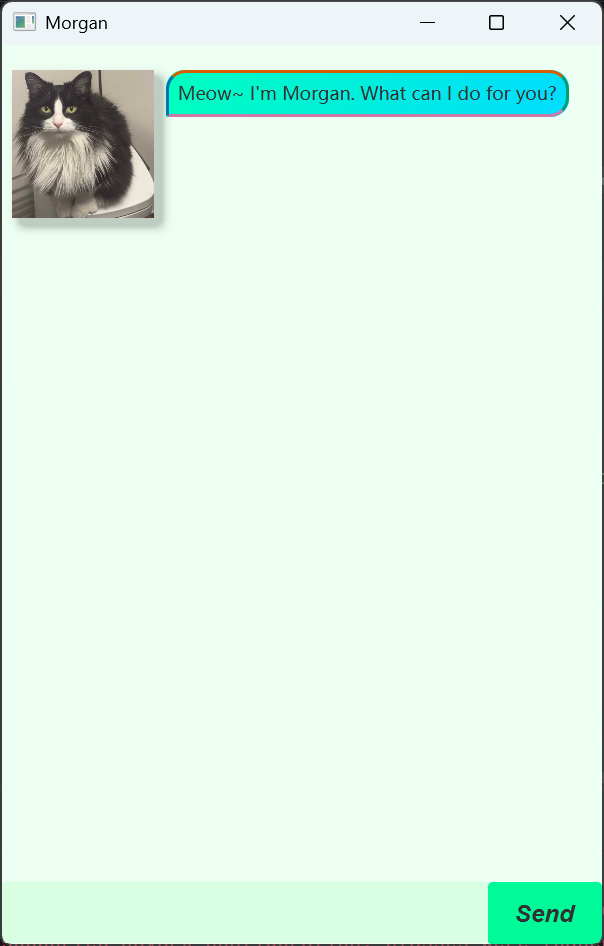

# Morgan User Guide

Morgan is a cat-themed desktop task manager for keeping track of to-dos, deadlines, and events. Type a command in the input box and press <kbd>Enter</kbd> or select **Send**.

## Quick start

1. Start Morgan.
2. Add a task, for example: `todo buy cat food`.
3. Use `list` to view all tasks.
4. Use `mark 1` after completing the first task.

Morgan saves task changes automatically. Your tasks will be loaded the next time you start the application.

## Command summary

| Command | Purpose |
| --- | --- |
| `todo DESCRIPTION` | Add a to-do task. |
| `deadline DESCRIPTION /by DATE` | Add a deadline. |
| `event DESCRIPTION /from START /to END` | Add an event. |
| `list` | Show all tasks. |
| `mark INDEX` | Mark a task as complete. |
| `unmark INDEX` | Mark a task as incomplete. |
| `delete INDEX` | Delete a task. |
| `find KEYWORD` | Find tasks whose descriptions contain the keyword. |
| `dates DATE` | Find deadlines and events that occur on a date. |
| `sort` | Sort all tasks alphabetically by description. |
| `bye` | Close Morgan. |

`INDEX` refers to the number shown by `list`; numbering starts from 1.

## Adding tasks

### Add a to-do: `todo`

Adds a task without a date or time.

Format: `todo DESCRIPTION`

Example: `todo buy cat food`

Morgan adds the task to the list as a to-do.

### Add a deadline: `deadline`

Adds a task that must be completed by a date.

Format: `deadline DESCRIPTION /by yyyy-MM-dd`

Example: `deadline submit assignment /by 2026-09-18`

The date must be a real calendar date in `yyyy-MM-dd` format.

### Add an event: `event`

Adds an event with a start and end date-time.

Format: `event DESCRIPTION /from yyyy-MM-dd HHmm /to yyyy-MM-dd HHmm`

Example: `event team meeting /from 2026-09-15 1400 /to 2026-09-15 1600`

Use a 24-hour time without a colon, such as `0930` or `1600`. The end date-time must be later than the start date-time.

## Managing tasks

### List tasks: `list`

Shows every task currently saved in Morgan.

Format: `list`

### Mark a task as complete: `mark`

Marks the specified task as done.

Format: `mark INDEX`

Example: `mark 2`

### Mark a task as incomplete: `unmark`

Marks the specified task as not done.

Format: `unmark INDEX`

Example: `unmark 2`

### Delete a task: `delete`

Permanently removes the specified task from Morgan.

Format: `delete INDEX`

Example: `delete 3`

### Sort tasks: `sort`

Sorts all tasks alphabetically by their descriptions, ignoring letter case.

Format: `sort`

## Finding tasks

### Find by keyword: `find`

Shows tasks whose descriptions contain the given keyword. Keyword matching is case-sensitive.

Format: `find KEYWORD`

Example: `find meeting`

### Find by date: `dates`

Shows deadlines due on a date and events that span that date.

Format: `dates yyyy-MM-dd`

Example: `dates 2026-09-15`

## Exit: `bye`

Closes Morgan after displaying a goodbye message.

Format: `bye`

## Troubleshooting

If Morgan reports an invalid command, check the command format and ensure that task numbers refer to an existing item in `list`. Dates must be valid calendar dates, and event end times must be after their start times.
